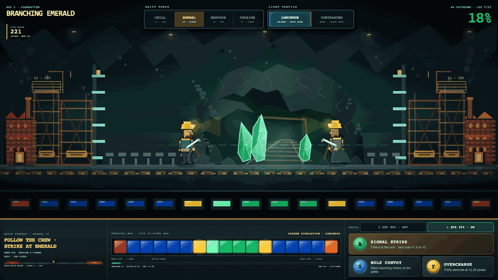
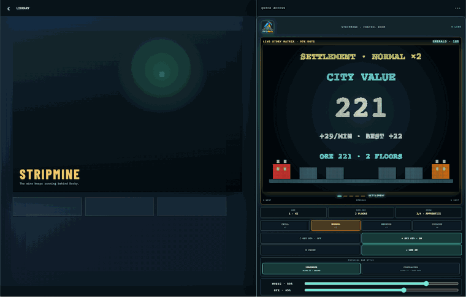
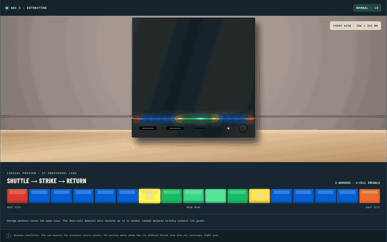
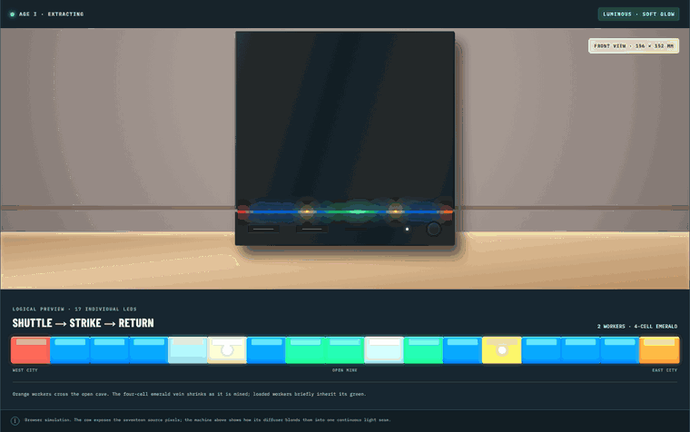

<p align="center"></p>

<h1 align="center">StripMine</h1>

<p align="center"><strong>A persistent mining city built across your television, Decky, and the Steam Machine's 17-LED light bar.</strong></p>

<p align="center">
  <a href="https://github.com/Albusquerque/StripMine/releases/tag/v0.1.0"><strong>Download v0.1.0</strong></a>
  ·
  <a href="https://albusquerque.github.io/stripmine-concept-site/"><strong>Try the interactive concept</strong></a>
</p>

## The living mine



Four miners cross an open cave, strike a shrinking mineral vein, carry its colour home, and turn every delivery into a taller twin city. The complete campaign spans five ages and 30 veins, from the first red signal to the final Metropolis.

## Decky becomes the control room



The Decky tab keeps the essential state legible without interrupting the shift. Its bright 4:3 Dot Matrix cycles through five story cards for the vein, workers, city, delivery score, and campaign progress. Tempo, music, effects, display profile, pause, reset, and the full game remain within reach.

## A game on seventeen physical lights



The machine starts with its old blue bar. A mineral appears near the centre, workers travel from both cities, and loaded workers briefly inherit the mineral colour on their return. Each vein begins four LEDs wide and shrinks as it is exhausted; permanent city lights grow at both ends.

## Luminous or Contrasted



- **Luminous** uses bright colour and soft glow for a bright room or a gentler diffuser.
- **Contrasted** inserts dark gaps, lowers routine output, and protects worker silhouettes when light spills strongly between LEDs.

The selected profile is shared by the full game, Decky, and the physical bar.

## What is in v0.1.0

- Five ages, 30 veins, six mineral families, and a 15–63 hour campaign depending on tempo.
- Four persistent miners, capped at two per side, with five real power ranks: yellow, green, orange, magenta, and white.
- Four live tempo modes: **Chill ×1**, **Normal ×2**, **Nervous ×3**, and **Cocaine ×4**.
- A delivery economy: **Payload × Crew Power × Signals × Combos × Foundry = City Value**.
- Persistent Crew, Logistics, and Industry upgrades in the city workshop.
- Three player actions: **A Signal Strike**, **X Hold / Bank Convoy**, and **Y Overcharge**.
- Per-worker pickaxe impacts, panned rock strikes, cargo rewards, milestone celebrations, and an adaptive procedural score.
- Music and SFX enabled by default, with persistent ON/OFF choices and independent volume controls.
- A first-launch cinematic, a four-act finale, atomic save data, and a reset that deliberately replays the introduction.
- Safe light-bar ownership: StripMine detects another writer, releases the LEDs on conflict, and restores the previous frame only while it still owns the device.

## Install with Decky Loader

StripMine is a **Decky Loader plugin**, not a conventional Steam game. Install [Decky Loader](https://github.com/SteamDeckHomebrew/decky-loader#-installation) first. StripMine is not yet listed in the Decky Plugin Store, so v0.1.0 must be sideloaded.

### Directly from the release URL — recommended

1. In Gaming Mode, open the Quick Access menu (`…`) and select the Decky plug icon.
2. Open Decky **Settings** (gear), enable **Developer mode** under **General**, then open **Developer**.
3. Choose **Install Plugin from URL** and paste:

   `https://github.com/Albusquerque/StripMine/releases/download/v0.1.0/StripMine-v0.1.0.zip`

4. Confirm the installation. If StripMine does not immediately appear, reload or restart Decky Loader, or reboot the device.
5. Open **Quick Access (`…`) → Decky → StripMine → Enter the mine**.

### From a downloaded ZIP

1. Download the `StripMine-v0.1.0.zip` asset from the [v0.1.0 release](https://github.com/Albusquerque/StripMine/releases/tag/v0.1.0). Do not use GitHub's automatically generated “Source code” ZIP.
2. Open **Decky Settings → Developer → Install Plugin from ZIP File** and select the downloaded archive. Do not extract it.
3. Reload or restart Decky Loader if the plugin does not immediately appear, then open **StripMine → Enter the mine**.

The full game remains playable in screen simulation when the 17-LED device is absent.

## Build from source

```bash
npm install
npm run typecheck
npm test
npm run build
npm run package
```

The installable archive is written to `out/StripMine-v0.1.0.zip`.

## LED ownership and hardware status

StripMine uses the same 17 `valve-leds` sysfs devices as SignalBar and PongBar. The ownership and conflict path is implemented and covered by local tests. Physical direction, diffuser readability, brightness, coexistence, and long-duration behaviour still need confirmation on the target Steam Machine; a successful build or sysfs write is not physical proof.

## Save data

Decky stores `stripmine.json` in the plugin settings directory. It contains the campaign, cities, miners, active time, upgrades, audio levels, tempo, and display profile. **Reset** requires explicit confirmation and returns the game to its first-launch cinematic.

## Roadmap

Full coexistence and hand-off compatibility is planned with [SignalBar](https://github.com/Albusquerque/SignalBar) and the still-in-development [SignalDot](https://github.com/Albusquerque/SignalDot). A dedicated version for the JSAUX Dot Matrix faceplate is also planned, with its larger display used as a real extension of the mine rather than a simple status panel.

## License

BSD 3-Clause. See [LICENSE](LICENSE).
